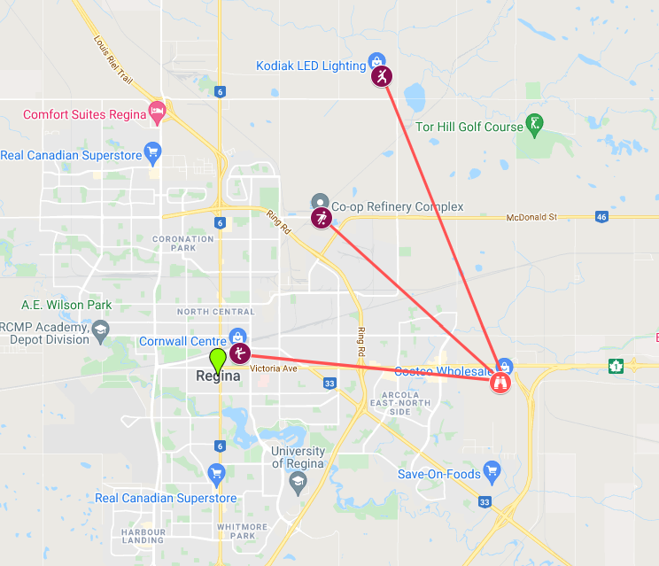

```{r setup, include=FALSE}
knitr::opts_chunk$set(echo = TRUE)
library(knitr)
library(mvtnorm)
library(coda)
library(tmvtnorm)
require(ggmap)
register_google(key="mykey",write = TRUE)
```

## 1. Introduction
Position resection and intersection are methods to determine an unknown geographic position by measuring angles with respect to known positions. In resection, the one point with unknown coordinates is occupied and sightings are taken to the known points. This project will demonstrate how these methods work in context of Bayesian Statistics.

This is the settings for the project, suppose you are at a location near Costco Wholesale(50.443492, -104.510223) and you do not know your position but you know coordinates of three other locations:
  Point1(50.484095, -104.579288) near Co-op Refinery
  Point2(50.5180655, -104.556831) near Kodiak LED Lighting
  Point3(50.450717, -104.610967)near Cornwall Center
The coordinates are latitude and longitude respectively. YOur current location and reference points can be shown in the map as below. 

```{r photo, echo=FALSE, fig.cap="Figure 1:Reference Points",fig.align='center',fig.height=4,fig.width=6,fig.retina=2}

pos=c(-104.510223, 50.443492) #your position
landmarks=data.frame(lon=c(-104.579288,-104.556831,-104.610967),
                     lat=c(50.484095,50.5180655,50.450717)) #coordinates of three reference points

```

Use a compass to measure the bearings from your location to reference points, we can get three bearings respectively for Point 1, Point 2, Point 3: <br />
alpha <- 312 #bearing between your position and Point 1 <br />
beta <- 338 #bearing between your position and Point 2 <br />
gamma <- 276 # bearing between your position and Point 3 <br / >

Ideally, the intersection of three lines will go though one point, that is your position. However, there are many factors that affect to our measurement then the intersections between lines creates a triangle as below.

```{r echo=FALSE, fig.align='center', fig.cap="Zooming", fig.height=7, fig.width=10, message=FALSE, warning=FALSE}
d <- seq(0,0.4,0.001) # Length of the line
alpha <- 312
beta <- 338
gamma <- 276
line1 <- data.frame(lon=landmarks[1,1] + d*sin(alpha*pi/180+pi),lat=landmarks[1,2] + d*cos(alpha*pi/180+pi))
line2 <- data.frame(lon=landmarks[2,1] + d*sin(beta*pi/180+pi),lat=landmarks[2,2] + d*cos(beta*pi/180+pi))
line3 <- data.frame(lon=landmarks[3,1] + d*sin(gamma*pi/180+pi),lat=landmarks[3,2] + d*cos(gamma*pi/180+pi))

map <- get_map(pos,zoom=12,maptype="roadmap")
mapPlot <- ggmap(map)+
geom_point(aes(x = lon, y = lat), size = 2, data = landmarks) +
geom_line(aes(x=lon,y=lat),data=line1) +
geom_line(aes(x=lon,y=lat),data=line2) +
geom_line(aes(x=lon,y=lat),data=line3)
mapPlot

```


So, your location is somewhere inside or around the triangle. Our aim of the project is to calculate the posterior of your location using known information about reference points and priors. In order to complete this project, you may need below R software packages: mvtnorm, coda, tmvtnorm, ggmap, osmar, geosphere, tidyverse,osmdata, showtext, rvest and sf.

## 2. Methods and Analysis
### 2.1 Assumptions

For given pair of coordinates $P_1=(\lambda_1,\phi_1$) and $P_2=(\lambda_2,\phi_2)$, the bearing angle from point P1 to point P2 is computed by following formula:

$$B(P_1, P_2)=(360+arctan(\frac{\lambda_2-\lambda_1}{\phi_2-\phi_1}).\frac{180}{\pi}) \  mod \ 360$$
```{r calculate bearings, include=FALSE}
B <- function(P1,P2){
  #This function calculate bearings between two points P1 and P2
  (360+atan((P2[1]-P1[1])/(P2[2]-P1[2]))*180/pi) %% 360
}

```

This formula assumes that the Earth is flat, and this gives almost correct values when we work on marginal area.The errors of measured bearings and calculated bearings follow normal distribution with zero-mean and variance of $\sigma^2$. We suppose that that the measurements of three bearings $\alpha, \beta, \gamma$ were made independently. Therefore, the likelihood function can be construct as below:
$$p(\alpha,\beta,\gamma|\lambda,\phi,\sigma)=N(\alpha|B((\lambda,\phi),(\lambda_1,\phi_1))*N(\alpha|B((\lambda,\phi),(\lambda_2,\phi_2))*N(\alpha|B((\lambda,\phi),(\lambda_3,\phi_3))$$

Where <br />
$(\lambda_1,\phi_1)=(-104.579288,50.484095)$ is the longitude and latitude for Point 1 <br />
$(\lambda_2,\phi_2)=(-104.556831,50.5180655)$ is the longitude and latitude for Point 2 <br />
$(\lambda_3,\phi_3)=(-104.610967,50.450717)$ is the longitude and latitude for Point 3 <br />
$(\lambda,\phi)$ is unknown longitude and latitude of your position <br />

The final assumptions are for prior distributions of $\lambda,\phi, \sigma$. Suppose, they have following distribution:<br />
$\lambda$ ~ Uniform(-105,-104) <br />
$\phi$ ~ Uniform(50,51) <br />
$\sigma$ ~ Exponential(20) <br />

### 2.2 Sampling

### 2.2.1 Stage 1-Uniform prior

Given measured bearings, we need to calculate posteriors of your location as well as variance of bearing error, they are noted as a vector of three parameter params=($\lambda,\phi,\sigma$). There are various methods of sampling such as fine grid , Sequential Importance Sampling, Metropolis-Hasting, Gibbs sampler(special case of Metropolis-Hastings). In this section, we will go with Metropolis-Hastings and use the Gelman-Rubin PSRF statistic to monitor the convergence of the simulation. 

From the assumptions mentioned in previous sections, we implement loglikelihood and logprior functions in R in order to calculate posteriors. Note that we use logarithm of density function instead of direct use. Since the target distribution is unknown and very complicated that we can not express in a closed form, we should use special sampling method. We use Metropolis-Hasting algorithm for this purpose since it guarantees the convergence of chains.

```{r loglikelihood, include=FALSE}
loglikelihood <- function(data,params){
  dnorm(alpha, B(data[1,],params[1:2])[1,1],params[3],log = T)+
    dnorm(beta, B(data[2,],params[1:2])[1,1],params[3],log=T)+
    dnorm(gamma, B(data[3,],params[1:2])[1,1],params[3],log=T)
}

logprior <- function(params){
  if (params[3]<=0)
    return (0)
  dexp(params[3],20,log = T)
}

```

We will simulate four chains simultaneously and monitor the convergence process, the final samples are stored in a R file "stage1_final.RData" for reproduction purpose and to avoid time consuming when generating report. Good proposal distribution is key to make our chains converge rapidly. After many experiments, We choose a multivariate normal distribution with covariance matrix COV.  <br />

```{r covariance matrix COV, echo=FALSE}
COV <- c(4e-6,4e-6,2e-3)*diag(3)
knitr::kable(COV, caption = "Stage 1-Covariance Matrix",label = "COV",align = "c")

```
It is noticed that our third parameter $\sigma$ must be greater than zero, so We  need to make some correction for our acceptance rate. We will use truncated multivariate normal distribution dtmvnorm from R package tmvtnorm as correction component. Some noticeable parameter of this function as below: <br />

dtmvnorm(x, mean = rep(0,nrow(sigma)), sigma = diag(length(mean)), 
  lower=rep(-Inf, length = length(mean)), upper=rep( Inf, length = length(mean)))

x: Vector or matrix of quantiles <br />

mean:	Mean vector <br />

sigma: Covariance matrix <br />

lower: Vector of lower truncation points, default is rep(-Inf, length = length(mean)). <br />

upper: Vector of upper truncation points, default is rep( Inf, length = length(mean)). <br />

After few iterations, we get converged chains for our location. Statistical factors such as potential scale reduction factor (PSRF) (less than 1.1) and traceplot show a truely stationary distribution.It is noted that two figures in the first row present the line and density chart of $\lambda$ , the second row connected to $\phi$ and the third row connected to $\sigma$

```{r Metropolis-Hasting code, eval=FALSE, include=FALSE}

prop.cov <- c(4e-6,4e-6,2e-3)*diag(3)
draws <- array(0,dim=c(4000,3,4))
mu <- c(-104.5,50.5,0.05)
draws[4000,,1] <- rtmvnorm(1,mu,prop.cov,c(-Inf,-Inf,0),c(Inf,Inf,Inf),algorithm = "gibbs")
draws[4000,,2] <- rtmvnorm(1,mu,prop.cov,c(-Inf,-Inf,0),c(Inf,Inf,Inf),algorithm = "gibbs")
draws[4000,,3] <- rtmvnorm(1,mu,prop.cov,c(-Inf,-Inf,0),c(Inf,Inf,Inf),algorithm = "gibbs")
draws[4000,,4] <- rtmvnorm(1,mu,prop.cov,c(-Inf,-Inf,0),c(Inf,Inf,Inf),algorithm = "gibbs")


loop <- 1 #count number of iterations
converged <- FALSE
while(!converged){
  draws[1,,] <- draws[4000,,]
  accepted <- c(1,1,1,1)
  for (step in 2:4000){
    for (chain in 1:4){
      proposed <- c(-104.5,50.5,-1)
      while(proposed[3]<=0){
        proposed <- rmvnorm(1,draws[step-1,,chain],prop.cov)
      }
      
      r <- loglikelihood(landmarks,proposed)+logprior(proposed) + 
        dtmvnorm(draws[step-1,,chain],as.vector(proposed),prop.cov,c(-Inf,-Inf,0),c(Inf,Inf,Inf),log=T)-
        loglikelihood(landmarks,draws[step-1,,chain])-logprior(draws[step-1,,chain])-
        dtmvnorm(as.vector(proposed),draws[step-1,,chain],prop.cov,c(-Inf,-Inf,0),c(Inf,Inf,Inf),log=T)
      
      u <- runif(1)
      if (log(u) < min(0,r)){
        draws[step,,chain] <- proposed
        accepted[chain] <- accepted[chain]+1
      } else {
        draws[step,,chain] <- draws[step-1,,chain]
      }
    }
  }
  chainlist <- mcmc.list(Chain1=mcmc(draws[,,1]),
                         Chain2=mcmc(draws[,,2]),
                         Chain3=mcmc(draws[,,3]),
                         Chain4=mcmc(draws[,,4]))
  converged <- all((gelman.diag(chainlist)$psrf[,2])<1.1)
  cat("ItERATION",loop,"\n")
  cat("Potential Scale Reduction Factor (PSRF)",gelman.diag(chainlist)$psrf[,2],"\n")
  cat("Acceptance rate:",accepted/40,"\n")
  loop <- loop+1
}

sample <- draws

```


```{r plot, echo=FALSE, message=FALSE, warning=FALSE,fig.height=6}

load("stage1_final.RData")
chainlist <- mcmc.list(Chain1=mcmc(draws[,,1]),
                         Chain2=mcmc(draws[,,2]),
                         Chain3=mcmc(draws[,,3]),
                         Chain4=mcmc(draws[,,4]))
cat("Upper Limits of PSRF:",gelman.diag(chainlist)$psrf[,2],"\n")

plot(chainlist)
``` 


### 2.2.3 Prior-Distance to Nearest Road

Difference with previous part, in this stage our priors depend on the distance from our location to the nearest road. Here is the prior:
$$\rho(\lambda,\phi) \propto N(\rho(\lambda,\phi)|0,6^2) $$
$$\sigma \sim Exponential(20)$$
Where $\rho(\lambda,\phi)$ is the shortest distance to the middle of the nearest road from the Open-StreetMap database. The R software packages osmdata, rvest, sf and geosphere support us to calculate this distance. That include several steps: identify intersection bearings of two bearings, then load all roads within 50 meters of the intersection of the first and the second bearing lines then calculate the distance.

```{r intersectbearings_roads, message=FALSE, warning=FALSE, include=FALSE}
#This chunk of codes identify the intersection bearings and all the nearest roads
require(osmar)
require(geosphere)
library(tidyverse)
library(osmdata)
library(showtext)
library(ggmap)
library(rvest)
library(sf)

intersectBearings <- function(p1,b1,p2,b2) {
x1 <- p1[1]
x2 <- p1[1] + 0.1*sin(b1*pi/180)
x3 <- p2[1]
x4 <- p2[1] + 0.1*sin(b2*pi/180)
y1 <- p1[2]
y2 <- p1[2] + 0.1*cos(b1*pi/180)
y3 <- p2[2]
y4 <- p2[2] + 0.1*cos(b2*pi/180)
x <- ((x1*y2-y1*x2)*(x3-x4)-(x1-x2)*(x3*y4-y3*x4))/((x1-x2)*(y3-y4)-(y1-y2)*(x3-x4))
y <- ((x1*y2-y1*x2)*(y3-y4)-(y1-y2)*(x3*y4-y3*x4))/((x1-x2)*(y3-y4)-(y1-y2)*(x3-x4))
return(as.numeric(c(x,y)))
}

intersection <- intersectBearings(landmarks[1,],alpha,landmarks[2,],beta)
box = center_bbox(center_lon=intersection[1], 
                                  center_lat=intersection[2],
                                  width=200,
                                  height=200)
# Get Highway Data from OSM
q = opq(st_bbox(box)) %>%
  add_osm_feature(key = "highway")
res = osmdata_sf(q = q)
hw_lines <- st_coordinates(res$osm_lines)[,1:2]


```

```{r include=FALSE}
distanceToRoad <- function(par) {
distance <- dist2Line(c(par[1],par[2]), hw_lines)
proper.distance <- distance[1] * 3.28084
return(proper.distance)
}

```

The sampling process is similar to the previous part but this case is more complicated and may need very long run. So,  We will use visualization of the chains instead of using Gelman-Rubin PSRF statistic to monitor the convergence. We will perform simulation with three chains, each has 80000 samples. The proposal is a multi-normal distribution with covariance matrix as:

```{r covariance matrix, echo=FALSE}

COV1 <- c(1e-10,1e-7,3e-4)*diag(3)
knitr::kable(COV1, caption = "Stage 2",label = "COV",align = "c",digits = 11)

```


```{r warning=FALSE, include=FALSE}
new_logprior <- function(params){
  dexp(params[3],20,log = T)+ dnorm(distanceToRoad(params[1:2]),0,6,log = T)
}

```

```{r eval=FALSE, warning=FALSE, include=FALSE}

prop.cov1 <- c(1e-10,1e-7,3e-4)*diag(3)
draws1 <- array(0,dim=c(60000,3,3))
mu <- c(-104.5,50.4,1)
draws1[60000,,1] <- rtmvnorm(1,mu,prop.cov1,c(-Inf,-Inf,0),c(Inf,Inf,Inf),algorithm = "gibbs")
draws1[60000,,2] <- rtmvnorm(1,mu,prop.cov1,c(-Inf,-Inf,0),c(Inf,Inf,Inf),algorithm = "gibbs")
draws1[60000,,3] <- rtmvnorm(1,mu,prop.cov1,c(-Inf,-Inf,0),c(Inf,Inf,Inf),algorithm = "gibbs")


draws1[1,,] <- draws1[80000,,]
accepted1 <- c(1,1,1)
for (step in 2:60000){
  print(step)
  for (chain in 1:3){
    proposed <- c(-104.5,50.5,-1)
    while(proposed[3]<=0){
      proposed <- rmvnorm(1,draws1[step-1,,chain],prop.cov1)
    }
      
    r <- loglikelihood(landmarks,proposed)+new_logprior(proposed) + 
      dtmvnorm(draws1[step-1,,chain],as.vector(proposed),prop.cov1,c(-Inf,-Inf,0),c(Inf,Inf,Inf),log=T)-
      loglikelihood(landmarks,draws1[step-1,,chain])-new_logprior(draws1[step-1,,chain])-
      dtmvnorm(as.vector(proposed),draws1[step-1,,chain],prop.cov1,c(-Inf,-Inf,0),c(Inf,Inf,Inf),log=T)
      
    u <- runif(1)
    if (log(u) < min(0,r)){
        draws1[step,,chain] <- proposed
        accepted1[chain] <- accepted1[chain]+1
      } else {
        draws1[step,,chain] <- draws1[step-1,,chain]
      }
    }
  }
chainlist1 <- mcmc.list(Chain1=mcmc(draws1[,,1]),
                         Chain2=mcmc(draws1[,,2]),
                         Chain3=mcmc(draws1[,,3]))
cat("ItERATION",loop1,"\n")
cat("Upper Limits of PSRF:",gelman.diag(chainlist1)$psrf[,2],"\n")
cat("Acceptance rate:",accepted1/600,"\n")

new_sample <- draws1

```

The sample is saved into R as final_S2.RData for reproduction and analysis. We can visualize the chains as below:

```{r echo=FALSE, fig.height=6}
load("stage2_final.RData")
chainlist2 <- mcmc.list(Chain1=mcmc(draws1[,,1]),
                         Chain2=mcmc(draws1[,,2]),
                         Chain3=mcmc(draws1[,,3]))
plot(chainlist2)
```

It is obvious that the first 25000 samples are "burn in" period, we can ignore this period and get final samples for us. We can visualize the final sample again and see that the chain of $\phi$ converge perfectly, while chains of $\lambda, \sigma$ can be weakly stationary. We may need longer chains to see the clear convergence.

```{r echo=FALSE,fig.height=6}
draws1 <- draws1[-c(1:25000),,]
chainlist2 <- mcmc.list(Chain1=mcmc(draws1[,,1]),
                         Chain2=mcmc(draws1[,,2]),
                         Chain3=mcmc(draws1[,,3]))
plot(chainlist2)

```


## 3. Results

In the first stage, we suppose the priors of our location follow uniform distribution and then applied Metropolis-Hasting algorithms we have samples for $\lambda$ and $\phi$ as well the error variance $\sigma$. The trace plots show that our chains converge after some iterations, the density map give us more concrete confirmation on that as detected area is entirely inside the triangle and very close to our expected  location. It proves that our algorithms work well.


```{r posteriors density on the map stage 1, echo=FALSE, message=FALSE, warning=FALSE,fig.height=5}
require(MASS)
require(reshape2)
load("stage1_final.RData")
sample <- draws
D <- kde2d(as.vector(sample[,1,]),as.vector(sample[,2,]),
    h=c(sd(sample[,1,]),sd(sample[,2,])),
    n=1024,
    lims=c(-104.4,-104.9,50.3,50.7)) # Enough to cover map
z <- melt(D$z)
z$Var1<-D$x[z$Var1]
z$Var2<-D$y[z$Var2]
map <- get_map(c(mean(sample[,1,]),mean(sample[,2,])),zoom=14,maptype="road")
mapPoints <- ggmap(map)+
geom_point(aes(x = lon, y = lat), size = 1, data = landmarks, alpha = .5) +
geom_raster(data=z,aes(x=Var1,y=Var2,fill=value))+
guides(fill=FALSE,alpha=FALSE)+
scale_fill_gradientn(colours=c("#0000FF00","#0000FFFF"))+
coord_cartesian() +
geom_line(aes(x=lon,y=lat),data=line1) +
geom_line(aes(x=lon,y=lat),data=line2) +
geom_line(aes(x=lon,y=lat),data=line3)+
geom_point(aes(x=lon,y=lat),
data=data.frame(lon=mean(sample[,1,]),lat=mean(sample[,2,])),
size=1,colour="#FF0000")
mapPoints


```

In the stage 2, it is assume that you are on the road. Although the traceplot do not show a perfect stationary chains but the density map indicates well your position on the road that which near our location. It is noted that as our sample for this case is large, so using full sample to plot density may cause your computer crash, so I just take a subsets of 8000 samples to present here only.

```{r posteriors density on the map stage 2, echo=FALSE, message=FALSE, warning=FALSE,fig.height=6}
sample1 <- draws1[sample(c(1:35000),8000,replace=FALSE),,]
D <- kde2d(as.vector(sample1[,1,]),as.vector(sample1[,2,]),
    h=c(sd(sample1[,1,]),sd(sample1[,2,])),
    n=1024,
    lims=c(-104.6,-104.50,50.43,50.437)) # Enough to cover map
z <- melt(D$z)
z$Var1<-D$x[z$Var1]
z$Var2<-D$y[z$Var2]
map <- get_map(c(mean(sample1[,1,]),mean(sample1[,2,])),zoom=15,maptype="road")
mapPoints1 <- ggmap(map)+
geom_point(aes(x = lon, y = lat), size = 1, data = landmarks, alpha = .7) +
geom_raster(data=z,aes(x=Var1,y=Var2,fill=value))+
guides(fill=FALSE,alpha=FALSE)+
scale_fill_gradientn(colours=c("#0000FF00","#0000FFFF"))+
coord_cartesian() +
geom_line(aes(x=lon,y=lat),data=line1) +
geom_line(aes(x=lon,y=lat),data=line2) +
geom_line(aes(x=lon,y=lat),data=line3)+
geom_point(aes(x=lon,y=lat),
data=data.frame(lon=mean(sample1[,1,]),lat=mean(sample1[,2,])),
size=1,colour="#FF0000")
mapPoints1

```


## 4. Conclusion
In this project we see that our target distributions are very complicated that we can not solve or express them in some closed forms. And Metropolis-Hastings Sampler proved to be useful in such cases. In the first stage, samples generated from this algorithm converged quickly. This is because we have a good proposal to start with. During tuning parameters in this stage, we learn that the variance of proposal distribution will move in opposite direction with acceptance rate. When acceptance rate is too high we may need to rise the variance to lower values to decrease the acceptance rate. Some papers mentioned that the acceptance rate is from 10% to 60% is fine and I try to control it between 20% to 50%. 

In the second stage, our priors differ significantly with stage 1 and we assume that you are on the road then the chains run much longer to converge. The results shows that predicted locations are perfectly fit to the road near our expected locations. When perform this simulation, I found that sometimes low value of PSFR (less than 1.2) do not guarantee the convergence, we must visualize to double check the results. And in some cases, changing different parameters, proposal do not work, we need to extend our chain for looking to the convergence.
